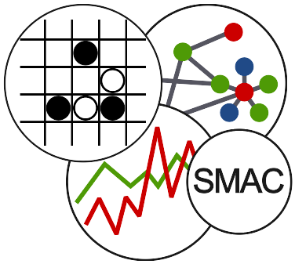
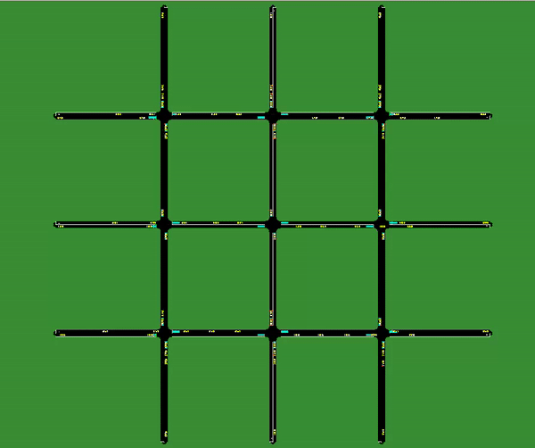

<!-- Improved compatibility of back to top link: See: https://github.com/othneildrew/Best-README-Template/pull/73 -->
<a name="readme-top"></a>
<!--
*** Thanks for checking out the Best-README-Template. If you have a suggestion
*** that would make this better, please fork the repo and create a pull request
*** or simply open an issue with the tag "enhancement".
*** Don't forget to give the project a star!
*** Thanks again! Now go create something AMAZING! :D
-->


<!-- PROJECT SHIELDS -->
[![Contributors][contributors-shield]][contributors-url]
[![Forks][forks-shield]][forks-url]
[![Stargazers][stars-shield]][stars-url]
[![Issues][issues-shield]][issues-url]
[![Status][status-shield]][status-url]
[![Version][version-shield]][version-url]
[![MIT License][license-shield]][license-url]
[![LinkedIn][linkedin-shield]][linkedin-url]


<!-- PROJECT LOGO -->
<br />
<div align="center">
  <a href="https://github.com/github_username/repo_name">
    
  </a>

<h3 align="center">sumo-experiments</h3>

  <p align="center">
    The sumo-experiments library implements a python interface for the Simulation of Urban MObility (SUMO) software.
    <br />
    <br />
    <a href="https://github.com/cristal-smac/sumo-experiments/tree/main/examples">Examples</a>
    ·
    <a href="https://github.com/cristal-smac/sumo-experiments/issues">Report Bug</a>
    ·
    <a href="https://github.com/cristal-smac/sumo-experiments/issues">Request Feature</a>
  </p>
</div>


<!-- TABLE OF CONTENTS -->
<details>
  <summary>Table of Contents</summary>
  <ol>
    <li>
      <a href="#about-the-project">About The Project</a>
    </li>
    <li>
      <a href="#getting-started">Getting Started</a>
      <ul>
        <li><a href="#prerequisites">Prerequisites</a></li>
        <li><a href="#installation">Installation</a></li>
      </ul>
    </li>
    <li><a href="#usage">Usage</a></li>
    <li><a href="#contributing">Contributing</a></li>
    <li><a href="#license">License</a></li>
    <li><a href="#contact">Contact</a></li>
    <li><a href="#acknowledgments">Acknowledgments</a></li>
  </ol>
</details>


<!-- ABOUT THE PROJECT -->
## About The Project

<p align="center">
  
</p>
<br/>

The `sumo-experiments` package aims to provide an ergonomic environment for creating and configuring highly reproducible SUMO simulations.

Creating a SUMO network for a simulation is very time-consuming. Infrastructure and flows have to be defined either using the `netedit` tool, 
or by manually creating all the numerous XML configuration files. This complexity also makes it difficult to reproduce experiments taken 
from scientific papers. The sumo-experiments package aims to solve this problem by deploying a set of tools to define SUMO networks, 
automatically generate configuration files and launch simulations, directly from Python.

For further information, please refer to the jupyter notebooks in the `examples` folder, which will guide you through the use of the package.


<!-- GETTING STARTED -->
## Getting Started

### Prerequisites

This package only work with Debian distributions. Also, you must install SUMO. Please refer to the [SUMO installation manual](https://sumo.dlr.de/docs/Downloads.php).

### Installation

1. Get the package from the Python Package Index.
    ```sh
    pip install sumo-experiments
    ```
   
2. Check that the `$SUMO_HOME` environment variable is set. This command must return the value of `$SUMO_HOME`.
    ```sh
    printenv | grep 'SUMO_HOME'
    ```
    If the variable is not set, you can add it __temporarily__ with the following command.
    ```sh
    export SUMO_HOME=your_path_to_sumo
    ```
   To set this variable permanently, write this in the `.bashrc` file.


<!-- USAGE EXAMPLES -->
## Usage

This script is one of the more simple uses of the package. We first instanciate a preset network from `preset_networks`. This
network contains only one intersection, making the junction between two two-way roads, with one lane for each way. Secondly, we
instanciate an `Experiment` with three parameters : 
    - The name of the experiment
    - A function that defines the infrastructures of the network (nodes, edges, connections, etc) from the preset network
    - A function that defines the flows of the simulation (vehicle types, density, etc) from the preset network
Finally, we run the simulation with the SUMO GUI.
We recommand you to use the clean files method to delete all configuration and data files.

```python
from sumo_experiments import Experiment
from sumo_experiments.preset_networks import OneCrossroadNetwork

network = OneCrossroadNetwork()
exp = Experiment('Test', network.generate_infrastructures, network.generate_flows_all_directions)
exp.run(gui=True)
exp.clean_files()
```

_For more examples, please refer to the [examples](https://github.com/cristal-smac/sumo-experiments/tree/main/examples) folder_


<!-- CONTRIBUTING -->
## Contributing

Contributions are what make the open source community such an amazing place to learn, inspire, and create. Any contributions you make are **greatly appreciated**.

If you have a suggestion that would make this better, please fork the repo and create a pull request. You can also simply open an issue with the tag "enhancement".
Don't forget to give the project a star! Thanks again!

1. Fork the Project
2. Create your Feature Branch (`git checkout -b feature/AmazingFeature`)
3. Commit your Changes (`git commit -m 'Add some AmazingFeature'`)
4. Push to the Branch (`git push origin feature/AmazingFeature`)
5. Open a Pull Request


<!-- LICENSE -->
## License

Distributed under the LGPL-2.1 License. See `LICENSE.txt` for more information.


<!-- CONTACT -->
## Contact

Jules Bompard - [Linkedin](https://www.linkedin.com/notifications/?filter=all) - jules.bompard.etu@univ-lille.fr

Project Link: [https://github.com/cristal-smac/sumo-experiments](https://github.com/cristal-smac/sumo-experiments)


<!-- ACKNOWLEDGMENTS -->
## Acknowledgments

* [othneildrew](https://github.com/othneildrew) for his useful README template.


<!-- MARKDOWN LINKS & IMAGES -->
<!-- https://www.markdownguide.org/basic-syntax/#reference-style-links -->
[contributors-shield]: https://img.shields.io/github/contributors/cristal-smac/sumo-experiments?style=for-the-badge&logo=github
[contributors-url]: https://github.com/cristal-smac/sumo-experiments/graphs/contributors
[forks-shield]: https://img.shields.io/github/forks/cristal-smac/sumo-experiments?style=for-the-badge&logo=github
[forks-url]: https://github.com/cristal-smac/sumo-experiments/network/members
[stars-shield]: https://img.shields.io/github/stars/cristal-smac/sumo-experiments?style=for-the-badge&logo=github
[stars-url]: https://github.com/cristal-smac/sumo-experiments/stargazers
[issues-shield]: https://img.shields.io/github/issues/cristal-smac/sumo-experiments?style=for-the-badge&logo=github
[issues-url]: https://github.com/cristal-smac/sumo-experiments/issues
[license-shield]: https://img.shields.io/github/license/cristal-smac/sumo-experiments?style=for-the-badge
[license-url]: https://github.com/cristal-smac/sumo-experiments/blob/master/LICENSE
[linkedin-shield]: https://img.shields.io/badge/-LinkedIn-black.svg?style=for-the-badge&logo=linkedin&colorB=555
[linkedin-url]: https://www.linkedin.com/in/jules-b-181b54185/
[status-shield]: https://img.shields.io/pypi/status/sumo-experiments?style=for-the-badge&logo=pypi
[status-url]: https://pypi.org/project/sumo-experiments/#history
[version-shield]: https://img.shields.io/pypi/v/sumo-experiments?style=for-the-badge&logo=pypi
[version-url]: https://pypi.org/project/sumo-experiments/#description


[product-screenshot]: images/sumo.gif


[Next.js]: https://img.shields.io/badge/next.js-000000?style=for-the-badge&logo=nextdotjs&logoColor=white
[Next-url]: https://nextjs.org/
[React.js]: https://img.shields.io/badge/React-20232A?style=for-the-badge&logo=react&logoColor=61DAFB
[React-url]: https://reactjs.org/
[Vue.js]: https://img.shields.io/badge/Vue.js-35495E?style=for-the-badge&logo=vuedotjs&logoColor=4FC08D
[Vue-url]: https://vuejs.org/
[Angular.io]: https://img.shields.io/badge/Angular-DD0031?style=for-the-badge&logo=angular&logoColor=white
[Angular-url]: https://angular.io/
[Svelte.dev]: https://img.shields.io/badge/Svelte-4A4A55?style=for-the-badge&logo=svelte&logoColor=FF3E00
[Svelte-url]: https://svelte.dev/
[Laravel.com]: https://img.shields.io/badge/Laravel-FF2D20?style=for-the-badge&logo=laravel&logoColor=white
[Laravel-url]: https://laravel.com
[Bootstrap.com]: https://img.shields.io/badge/Bootstrap-563D7C?style=for-the-badge&logo=bootstrap&logoColor=white
[Bootstrap-url]: https://getbootstrap.com
[JQuery.com]: https://img.shields.io/badge/jQuery-0769AD?style=for-the-badge&logo=jquery&logoColor=white
[JQuery-url]: https://jquery.com 